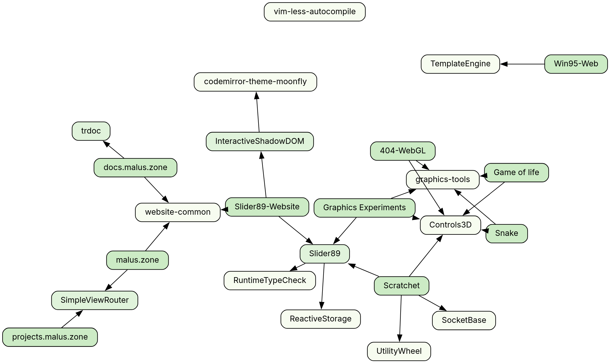

# Heya 🏳️‍🌈
I'm Malus, a cheepup on the internet who studies computer science badly and
codes too much. You can check out some of my silly projects on my website
[malus.zone 🐆](https://malus.zone). I'm active on
[GitLab 🦊](https://gitlab.com/Maluscat) and [GitHub 🐙](https://github.com/Maluscat).

## Projects
Coding is my main pastime - I love building cool stuff and improving my skills.
The majority of my projects have evolved from one another, resulting in my own
little code ecosystem that I sink a lot of time into. I maintain some neat
libraries and have built various web projects, all with a focus on being
configurable, modular and easy to use.

**Legend:** 
✅ Released and maintained or feature-complete 
▶️ Unreleased but being developed 
💤 Rarely worked on 
❌ Not worked on anymore 

<!-- Left out: TemplateEngine, KeyControl, lptr, eptr -->

### Web projects
- ✅ [Malus.zone](https://gitlab.com/Maluscat/malus.zone) ([Website](https://malus.zone)),
    my website
- ✅ [Game of Life](https://gitlab.com/Maluscat/game-of-life) ([Website](https://malus.zone/games/gameoflife)),
    a feature-rich implementation of Conway's Game of Life
- ✅ [Website-Common](https://gitlab.com/Maluscat/website-common/),
    a bunch of shared templates and static files for internal use by all my websites
- ▶️ [404-WebGL](https://gitlab.com/Maluscat/404-webgl), an upcoming 404 page
- 💤 [Scratchet](https://gitlab.com/Maluscat/scratchet) ([GitHub](https://github.com/Maluscat/Scratchet)) ([Website](https://scratchet.malus.zone)),
    a WebSocket based multiplayer drawing app with no external dependencies
- ❌ [Snake](https://github.com/Maluscat/snake),
    a very rough implementation of both a normal game of Snake and Snake on three axes
- ❌ [Win95-Web](https://github.com/Maluscat/win95-web) ([Website](https://malus.zone/win95/)),
    a barebones JS implementation of Windows 95 with a feature-complete Minesweeper
- ❌ [Graphics Experiments](https://gitlab.com/Maluscat/graphics-experiments) ([Website](https://malus.zone/graphics)),
    projects I did years ago to learn about WebGL and WebGL2
- ❌ [Graphics tools](https://gitlab.com/Maluscat/graphics-tools),
    a collection of small WebGL2 helpers for use within my websites

### Libraries
#### Bigger
- ▶️ [SimpleViewRouter](https://gitlab.com/Maluscat/simple-view-router/) (GitHub pending) (npm pending),
    a clean and intuitive static site generator and dynamic router
- ▶️ [InteractiveShadowDOM](https://gitlab.com/Maluscat/interactive-shadow-dom/),
    a dynamic front end window multiplexer
- ▶️ [trdoc](https://gitlab.com/Maluscat/trdoc) ([Website](https://docs.malus.zone/)),
    a TypeDoc-based single-page documentation generator for TypeScript
- ▶️ [Slider89](https://github.com/Maluscat/Slider89), a front end range slider library

#### Small and self-contained
- ✅ [SocketBase](https://gitlab.com/Maluscat/socket-base) ([GitHub](https://github.com/Maluscat/socket-base)) ([npm](https://www.npmjs.com/package/@maluscat/socket-base)),
    a tiny abstraction layer over WebSockets that automatically
    handles pings, timeouts and reconnects
- ✅ [RuntimeTypeCheck](https://gitlab.com/Maluscat/runtime-type-check) ([GitHub](https://github.com/Maluscat/runtime-type-check)) ([npm](https://www.npmjs.com/package/@maluscat/runtime-type-check)),
    a modular runtime type checker with a focus on smart and readable error
    messages
- ✅ [UtilityWheel](https://gitlab.com/Maluscat/utility-wheel) ([GitHub](https://github.com/Maluscat/utility-wheel)),
    a drop-in front end utility wheel with four sections
- ▶️ [Controls3D](https://gitlab.com/Maluscat/controls3d),
    a library for handling mouse and touch controls both in 2D and 3D space,
    featuring a comprehensive animation system
- ▶️  [ReactiveStorage](https://gitlab.com/Maluscat/reactive-storage) ([GitHub](https://gitlab.com/Maluscat/reactive-storage)) ([npm](https://www.npmjs.com/package/reactive-storage)),
    a library that allows the creation of deeply reactive data without the need for proxies

#### Misc
- ✅ [vim-less-autocompile](https://github.com/Maluscat/vim-less-autocompile),
    a Vim plugin to automatically compile Less files to CSS on save
- ✅ [codemirror-theme-moonfly](https://gitlab.com/Maluscat/codemirror-theme-moonfly) ([npm](https://www.npmjs.com/package/codemirror-theme-moonfly)),
    a port of an excellent Vim dark theme for the [CodeMirror](https://codemirror.net/) editor

### Standalone stuff
- ✅ [dotfiles](https://github.com/Maluscat/dotfiles), containing my Vim config

## Dependency graph
Here's a fun little dependency graph over all of my (side) projects.
Generated using [Graphviz](https://graphviz.org/) with the
[sfdp](https://graphviz.org/docs/layouts/sfdp/) layout engine.

